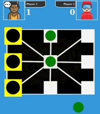
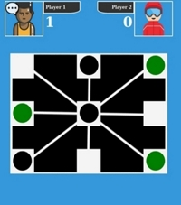
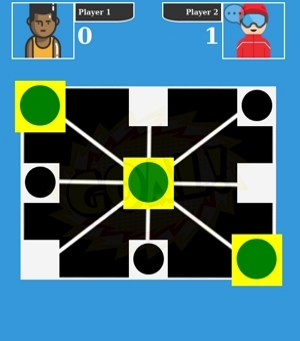

# DAMA-GAME
**Version 1.0.0**

## [\[Click here to play the game\]](https://condescending-khorana-5a1739.netlify.com/)

---
## Summary
**DAMA GAME** is the web app version of the pencil-and-paper game where two players take turn placing their pawns on the board, the first player to succeed in placing his pawns in a horizontal, vertical or a diagonal row wins the round/game and scores one point as shown in the pictures above. 

I also provided a link to the game in case you wanted to give it a try without downloading my repo, hope you will enjoy it.

---

## How To Play
* At the start of the game, each player owns three pawns at hand.
* Players are only allowed one single move per round.
* During the first 6 rounds players have to place their pawns respectively on the board, until their hands are empty.
* Pawns cannot be moved from one spot to another until all of three pawns have been palced on the board.
* If players' hands have emptied and none of the players had made a row of three, then players are able to move their pawns by sliding the pawn across a white line that connects its actual position to an empty spot.
* The goal is beating your opponent into making a row of three first.
* The game can never end in a tie since pawns can still be moved once placed on the board.

---
## Contributors
* M.Sylla <iam.mosylla@gmail.com>
---
## License & Copyright
© M.Sylla 

Licensed under the [Apache License, Version 2.0](LICENSE).

